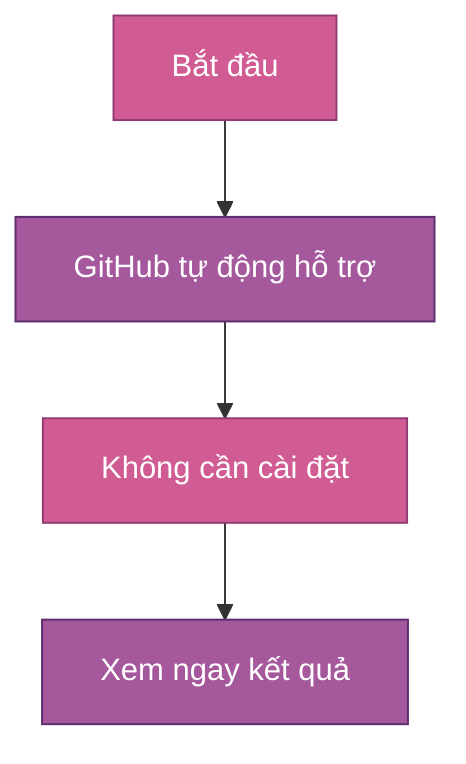

# hoc-mermaid

```mermaid
graph TD
    A[Bắt đầu] --> B[GitHub tự động hỗ trợ]
    B --> C[Không cần cài đặt]
    C --> D[Xem ngay kết quả]

    %% Định nghĩa màu hồng-tím blend
    classDef lotusPink fill:#D15C93,color:#fff,stroke:#8E3B74;
    classDef lotusPurple fill:#A5589C,color:#fff,stroke:#5B2C6F;

    %% Gán màu
    class A lotusPink;
    class B lotusPurple;
    class C lotusPink;
    class D lotusPurple;

```
