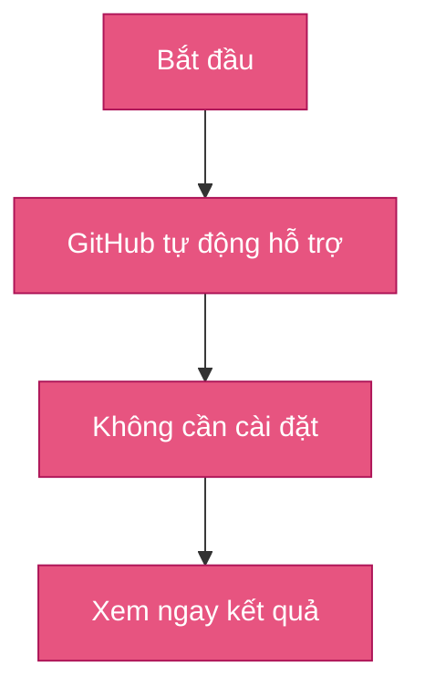

# hoc-mermaid

```mermaid
graph TD
    A[Bắt đầu] --> B[GitHub tự động hỗ trợ]
    B --> C[Không cần cài đặt]
    C --> D[Xem ngay kết quả]

    %% Định nghĩa màu hồng cánh sen
    classDef lotus fill:#E75480,color:#fff,stroke:#AD1457;

    %% Gán màu cho tất cả node
    class A,B,C,D lotus;


```
