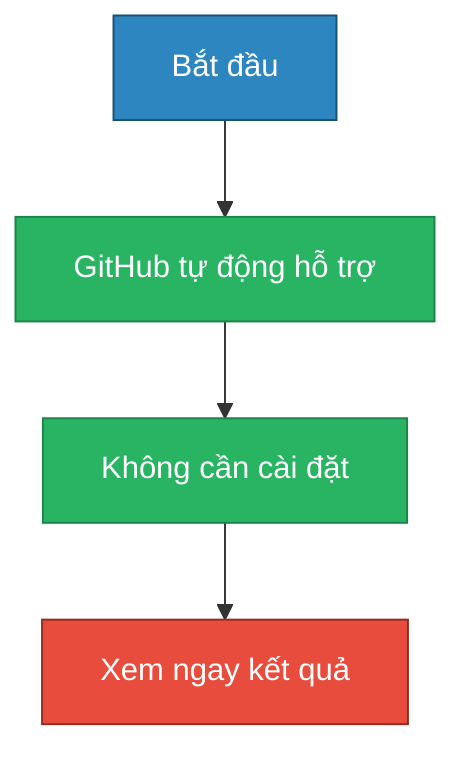

# hoc-mermaid

```mermaid
graph TD
    A[Bắt đầu] --> B[GitHub tự động hỗ trợ]
    B --> C[Không cần cài đặt]
    C --> D[Xem ngay kết quả]

    %% Định nghĩa màu
    classDef start fill:#2E86C1,color:#fff,stroke:#1B4F72;
    classDef process fill:#28B463,color:#fff,stroke:#1D8348;
    classDef finish fill:#E74C3C,color:#fff,stroke:#922B21;

    %% Gán màu
    class A start;
    class B process;
    class C process;
    class D finish;

```
